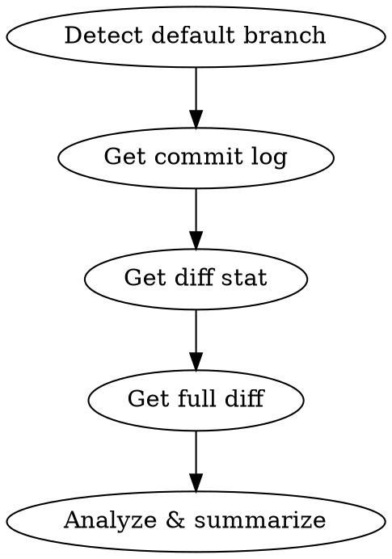

# Branch Context

## Overview

Analyze the diff between the current branch and the default branch to understand what has been done. Produces a structured summary of intent, scope, and changes.

## When to Use

- Starting a new session on a branch with existing work
- Resuming work after a break
- Reviewing someone else's branch
- Before making changes, to understand current direction
- When asked "what are we working on?" or "what's changed?"

## Process



### 1. Detect Default Branch

```bash
git symbolic-ref refs/remotes/origin/HEAD 2>/dev/null | sed 's@^refs/remotes/origin/@@' || echo "main"
```

### 2. Find the Merge Base

Compare against where the branch **diverged from** the default branch, not the current tip of default. This avoids treating new commits on default as "deletions" on this branch.

```bash
MERGE_BASE=$(git merge-base <default> HEAD)
```

### 3. Gather Context

Run these in parallel, using `$MERGE_BASE`:

**Commit log** (what story do the commits tell):
```bash
git log --oneline --no-merges $MERGE_BASE..HEAD
```

**Diff stat** (scope at a glance):
```bash
git diff $MERGE_BASE...HEAD --stat
```

**Full diff** (the actual changes):
```bash
git diff $MERGE_BASE...HEAD
```

**Uncommitted work** (in-progress but not yet committed):
```bash
git diff HEAD --stat
```

### 4. Analyze & Summarize

Produce a structured summary with these sections:

| Section | What to include |
|---------|----------------|
| **Branch purpose** | One sentence: what is this branch trying to accomplish? |
| **Key changes** | Bullet list of the major modifications grouped by concern (e.g., "new API endpoint", "database migration", "UI component") |
| **Files touched** | Categorized list: new files, modified files, deleted files. Note uncommitted changes separately if any. |

## Output Format

```markdown
## Branch: `<branch-name>`
**Purpose:** <one-sentence summary>
**Base:** `<default-branch>` | **Commits ahead:** <N>

### Key Changes
- <grouped change 1>
- <grouped change 2>

### Files (<N> changed)
**New:** file1, file2
**Modified:** file3, file4
**Deleted:** file5
**Uncommitted:** file6, file7 (if any)
```

## Tips

- If the diff is very large (100+ files), focus on the stat summary and commit messages rather than reading every line
- Pay attention to test files — they reveal intent more clearly than implementation
- Look at new files first — they usually represent the core of new work
- Check for TODO/FIXME comments in the diff — they reveal what the author considered unfinished
